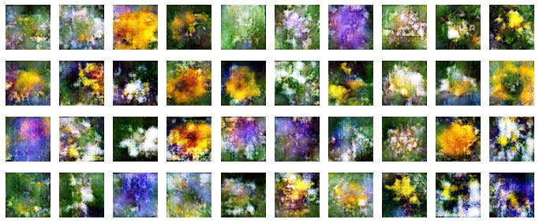
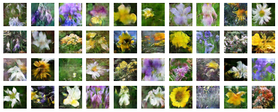
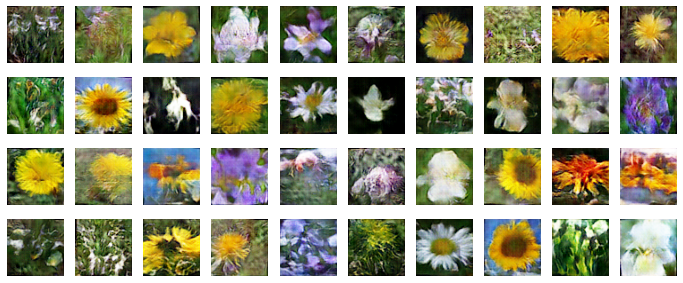

# Flower GAN Tensorflow

## Introduction
Generating new images of flowers using Tensorflow to implement a [WGAN-GP](https://arxiv.org/pdf/1704.00028.pdf). The model is trained using the [Oxford Flowers dataset](https://www.robots.ox.ac.uk/~vgg/data/flowers/).

 

## Training
Training process may take a while because the model needs at least 30000 epochs to generate images of flowers.

 

## Results
After 5000 epochs training the generated output was not good enough:

So next time the model trained after 30000 epochs and the results were much better:

## Usage
You can train the model and get the generated results by running Flower_GAN.ipynb in colab notebook.